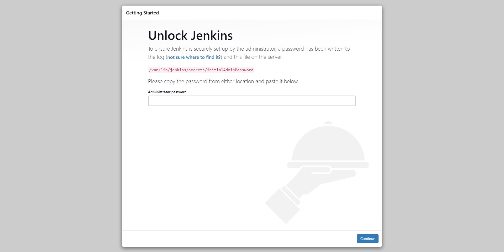
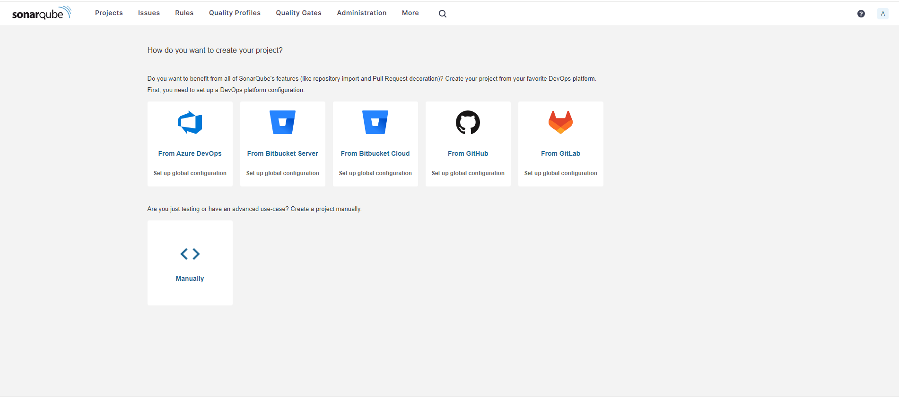
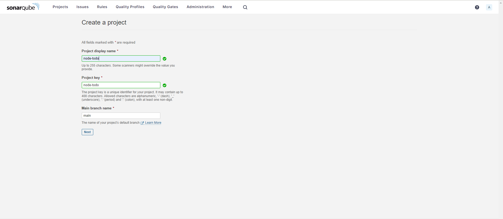
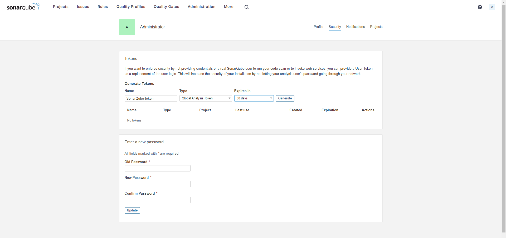
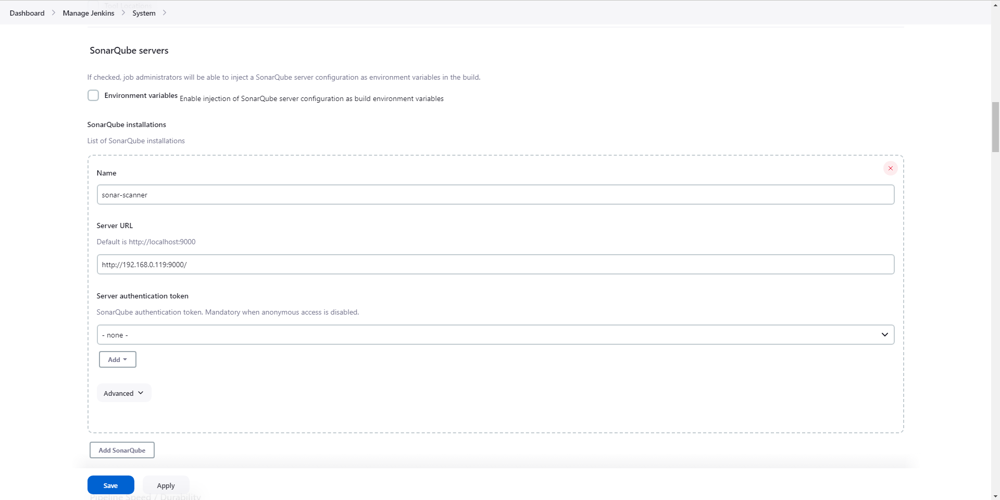
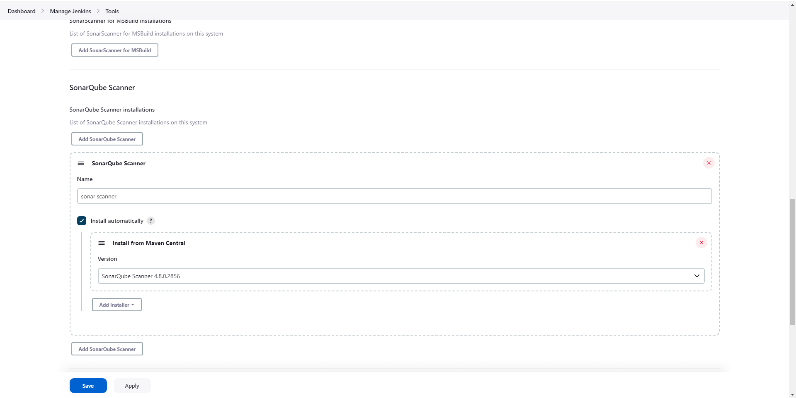
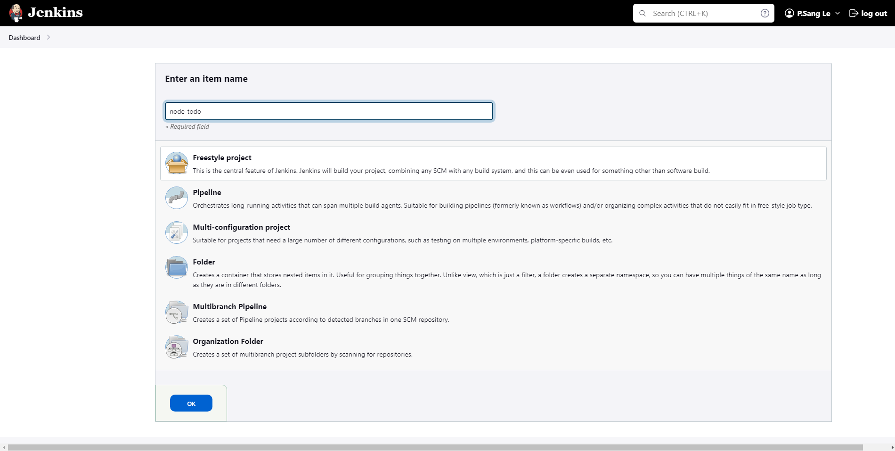

# Build a CI/CD pipeline using Jenkins


## Introduction
In this project, we will use different tools such as Jenkins, SonaQube, Docker, and AWS EC2 to build an automated CI/CD pipeline for a web application. This pipeline includes build, testing, and deploying the web application on AWS EC2 instances.

## Build and setup
1. Create EC2 Instances
2. Setting up Instances
3. Integrating SonarQube for Jenkins
4. Create a Jenkins for Deploying Web Application
   - Configuring Pipeline for SonarQube
   - Configuring Pipeline for Docker

### Create EC2 Instances
In this step, we will use [AWS CLI](https://docs.aws.amazon.com/pdfs/cli/latest/userguide/aws-cli.pdf) to create the EC2 Instances.

- **Create key pair**

A key pair, consisting of a public key and a private key, is a set of security credentials that are used to prove your identity when connecting to an Amazon EC2 instance.
      
To create the key pair for instances, we will use the command:
```
aws ec2 create-key-pair --key-name <keypair-Name> --query 'KeyMaterial' --output text> <keypair-Name.pem>
```

After that, it will generate the RSA PRIVATE KEY inside the .pem file:
    


On the other hand, your PUBLIC KEY appears in the AWS Console:
  


    
- **Create Security Group**

A security group controls the inbound traffic that's allowed to reach the instances associated with the security group and the outbound traffic that's allowed to leave them.

By using this command, we will create 2 security groups for 2 instances:

```
aws ec2 create-security-group --group-name <security grp Name> --description "<Description>"
```


2 security groups were not set up for the inbound traffic. Therefore, for each security group, we need to set up different rules:

In the first instance:


In the second instance:


- **Create two EC2 instances**

The following command will launch the instance:

```
aws ec2 run-instances --image-id <ami-Id> --count 1 --instance-type <type> --keyname <keypair-Name> --security-groups <security grp Name>
```

After creating 2 instances, we should add the tags:
```
aws ec2 create-tags --resources <Instance-Id>--tags Key=Name,Value=<value>
```


### Setting up Instances

In this step, we will install Jenkins and Docker on 1st instance and install SonarQube on 2nd instance

To install Jenkins, Docker, and SonarQube on instances, we have to ssh to your instance in your terminal by using command:

```
ssh -i <keypair.pem> ec2-user@<public-ip-v4>
```

- For the first instance:
  
Install Jenkins:
```
curl -fsSL https://pkg.jenkins.io/debian-stable/jenkins.io-2023.key | sudo tee \
  /usr/share/keyrings/jenkins-keyring.asc > /dev/null
echo deb [signed-by=/usr/share/keyrings/jenkins-keyring.asc] \
  https://pkg.jenkins.io/debian-stable binary/ | sudo tee \
  /etc/apt/sources.list.d/jenkins.list > /dev/null
sudo apt-get update
sudo apt-get install jenkins
```
Copy the public IPv4 address of instance 1, paste it into your browser, and put the port number 8080. We will see:



To unlock Jenkins paste the secret key to Administrator password, get the secret key through this command:

```
sudo cat /var/lib/jenkins/secrets/initialAdminPassword
```

After unlocking Jenkins click on "Install suggested plugins" and then provide the basic details on the "Create First Admin User" page and get to the Jenkins dashboard after completing all the required steps.


Install Docker by using the following commands:

```
sudo apt-get install docker.io
```

- For the second instance:

To install SonarQube to your instance run the following command:
```
sudo apt update
sudo apt install openjdk-17-jre 
wget https://binaries.sonarsource.com/Distribution/sonarqube/sonarqube-10.0.0.68432.zip

sudo apt install unzip -y
unzip sonarqube-10.0.0.68432.zip
cd /home/ubuntu/sonarqube-10.0.0.68432/bin/linux-x86-64
./sonar.sh start
```
Copy the Public Ipv4 of SonarQube instance and paste it on the browser and use port 9000. And login with **username: admin** and **password: admin**.
After login successfully, we will see the dashboard of Sonarqube



Click "Manually" icon. Give the name for Project key and Display name, then click Set Up button!



After set up project, move to **My Accounts => Security => Generate Tokens**
Create a Token for integrating with Jenkins:




### Integrating SonarQube for Jenkins

Now, we move to Jenkins Dashboard


Install some plugins on Jenkins for setting up SonarQube. By clicking **Manage Jenkins => Manage Plugins => Available Plugins**. Now, in Available Plugins, search SonarQube Scanner. After selecting it then click on **Install without restart**

Return back to Jenkins Dashboard, click on **Manage Jenkins => System**, search for SonarQube servers, and click the **Add Sonarqube** button. Copy the Public IP of SonarQube and paste it, and put port 9000 after it in such format http://Public IPv4:9000 . Apply & save it:



On Jenkins Dashboard click on **Manage Jenkins => Tool** and search for SonarQube Scanner under it. After clicking on **Add SonarQube Scanner**, give a name and check on Install automatically for its installation, and then save it.




### Create Jenkins for Deploying Web Application

Now, we return back to Jenkins Dashboard, and click on **Create a Job** button.


Select the project type you want to create, then give it an item name and click **OK**




