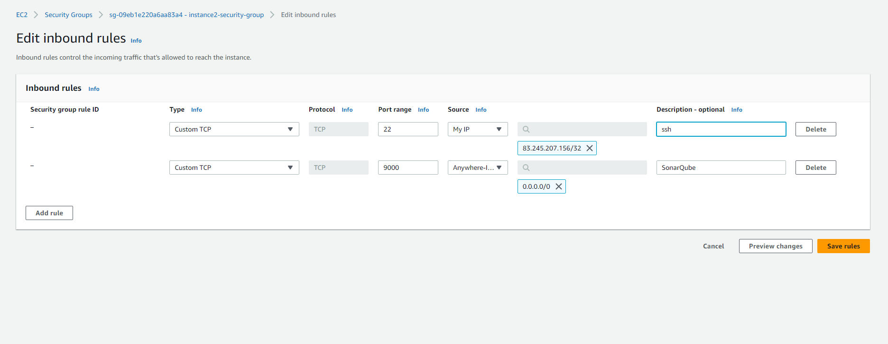

# Build a CI/CD pipeline using Jenkins


## Introduction
In this project, we will use different tools such as Jenkins, SonaQube, Docker, and AWS EC2 to build an automated CI/CD pipeline for a web application. This pipeline includes build, testing, and deploying the web application on AWS EC2 instances.

## Build and setup
1. Create EC2 Instances
2. Setting up Instances
3. Integrating SonarQube for Jenkins
4. Create a Jenkins for Deploying Web Application
   - Configuring Pipeline for SonarQube
   - Configuring Pipeline for Docker

### Create EC2 Instances
In this step, we will use [AWS CLI](https://docs.aws.amazon.com/pdfs/cli/latest/userguide/aws-cli.pdf) to create the EC2 Instances.

- **Create key pair**

A key pair, consisting of a public key and a private key, is a set of security credentials that are used to prove your identity when connecting to an Amazon EC2 instance.
      
To create the key pair for instances, we will use the command:
```
aws ec2 create-key-pair --key-name <keypair-Name> --query 'KeyMaterial' --output text> <keypair-Name.pem>
```

After that, it will generate the RSA PRIVATE KEY inside .pem file:
    


On the other hand, your PUBLIC KEY appears in the AWS Console:
  


    
- **Create Security Group**

A security group controls the inbound traffic that's allowed to reach the instances associated with the security group and the outbound traffic that's allowed to leave them.

By using this command, we will create 2 security groups for 2 instances:

```
aws ec2 create-security-group --group-name <security grp Name> --description "<Description>"
```


There are 2 security groups that were not set up for the inbound traffic. Therefore, for each security group, we need to set up different rules:

In the first instance:


In the second instance:




- **Create two EC2 instances**
  
### Setting up Instances
  
### Integrating SonarQube for Jenkins
  
### Create Jenkins for Deploying Web Application
  

